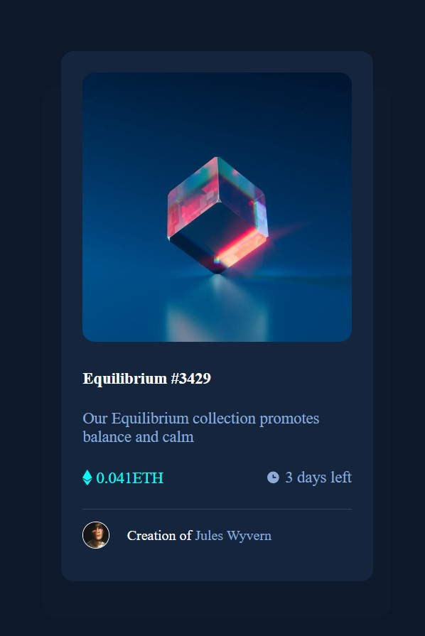

# Frontend Mentor - NFT preview card component solution

This is a solution to the [NFT preview card component challenge on Frontend Mentor](https://www.frontendmentor.io/challenges/nft-preview-card-component-SbdUL_w0U). Frontend Mentor challenges help you improve your coding skills by building realistic projects.

## Table of contents

-   [Overview](#overview)

    -   [The challenge](#the-challenge)
    -   [Screenshot](#screenshot)
    -   [Links](#links)
    -   [Built with](#built-with)

-   [Author](#author)

## Overview

### The challenge

Users should be able to:

-   View the optimal layout depending on their device's screen size
-   See hover states for interactive elements

### Screenshot

### Links

-   Solution URL: [Add solution URL here](https://www.frontendmentor.io/solutions/vite---semantic-html5-markup---css-custom-properties-flexbox-DJmAjK4T27)

-   Live Site URL: [Add live site URL here](https://aposte7.github.io/nft-preview-card-component/)

## My process

### Built with

-   vite
-   Semantic HTML5 markup
-   CSS custom properties
-   Flexbox
-   CSS Grid

## Author

-   Frontend Mentor - [@aposte7](https://www.frontendmentor.io/profile/@aposte7)
